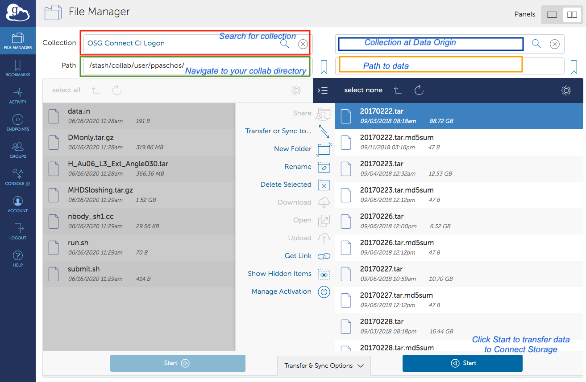

# Snowmass Connect

The purpose of this documentation is to provide critical information for researchers with the Snowmass21 collaboration to access
the Open Science Grid (OSG) via the Snowmass Connect service hosted at the University of Chicago.

## Getting Started

Snowmass Connect is a job submission service providing access to the Open Science Grid. To sign up, visit [https://connect.snowmass21.io](https://connect.snowmass21.io). It is important to upload your ssh-keys following the instructions on the site. The process will create your
home directory on the Snowmass submit node and grant you access via passwordless ssh.

## Login to the submit node

Once you upload your ssh-keys in the Snowmass Connect portal you can connect to the login node via passwordless ssh as:

`ssh <user_id>@login.snowmass21.io` 

You can find your `<user_id>` from your profile on the Snowmass Connect portal. 
The login node is also a submission node for jobs to the Open Science Grid. Upon login you will land in your home directory `/home/user_id`. Your home 
directory has 50GB of quota. Use your home directory to store submission files and scripts.

## Transferring Data to and from the OSG Storage

Data used as input for jobs to the OSG grid should be transferred to the OSG storage allocated for the Snowmass21 project 
using Globus Online. Instructions on how to set up Globus Connect Personal can be found [here](https://www.globus.org/globus-connect-personal). 
Access to the OSG storage endpoint is enabled by authenticating against the Globus collection "OSG Connect CI Logon" using the GLobus Connect client. 
You can search for the collection by name in the search bar of the File Manager.

To access storage via Globus online users must have an institutional based grid certificate issued by CILogon. To obtain one follow the steps below:

1. Logon with your institutional credentials at http://cilogon.org
2. Select "Create a Password Protected Certificate". Enter a password and download your encrypted certificate, named usercred.p12. The certificate can be obtained 
by using the openssl pcks12 command as: `openssl pkcs12 -in [your-cert-file] -clcerts -nokeys -out usercert.pem` 
3. Email to paschos@uchicago.edu the output of the following command which will print out your DN (Distinguish Name): `openssl x509 -in usercert.pem -noout -subject` 

Once your DN has been entered in the user access list you will be able to access the OSG Connect CI Logon collection with the Globus Connect client by 
validating with your institution credentials. Navigate to the OSG Snowmass21 Collaborations Connect storage by typing in the Path box `/stash/collab`. You can then navigate to your user directory as shown in the example below:

Shown in the image above are two possible destinations for the data.

1. Navigate to `/stash/collab/project/snowmass21` if data are to be shared by multiple users.
2. Navigate to `/stash/collab/user/<user_id>` if data are for the exclusive use of a single user.
In both cases, users can create subdirectories and organize content by either using the Globus client interface or from the login.snowmass21.io node. 

On the right panel of the Globus Connect client tool you can search and connect to another collection. The latter can be your own laptop/server or a collaboration end point that has provided a Globus Connect door for the researchers to use. 

To transfer files you can select the list files from your local computer and then select Start. To transfer files out simply reverse the direction of the process. 

 **Important** Users can not access their home directories in the snowmass21 login node over the Globus door. However, users do have access to the /stash/collab directory when they login to login.snowmass21.io. Files can be moved or copied over to their home directory but it is strongly discouraged for files larger than a few MB.

## Data for computational workflows to the OSG grid 

As disussed above, users should place their science input data for processing on the Open Science Grid in /stash/collab/user/<user_id> or /stash/collab/project/snowmass21. There's no quota on this filesystem but expect about 10TB available. Data can be transferred to the grid as part of an OSG job using the stashcp tool. You can insert the following command in your execution script to move data from your collab space to the remote worker node where your 
job is running: 

    module load stashcache
    stashcp /osgconnect/collab/user/<user_id>/<input_file> .

To transfer data back to your collab space from the remote node that is running your job you can execute the following command:

    stashcp <output_file> stash:///osgconnect/collab/user/<user_id>/<output_file>

## Job submissions

A typical submission script is inlined below. 

    Universe = Vanilla
    Executable     = run.sh
    Requirements = && (HAS_MODULES =?= TRUE)
    Error   = output.err.$(Cluster)-$(Process)
    Output  = output.out.$(Cluster)-$(Process)
    Log     = output.log.$(Cluster)
    should_transfer_files = YES
    WhenToTransferOutput = ON_EXIT
    +ProjectName="snowmass21"
    Queue 1

The file run.sh is an executablle script that contains the list of commands that executes your workload 
along with any directives that move data as noted above. By default, the submission script above will use the HTCondor file transfer 
method to transfer the `Executable` to the remote host and the `Error`, `Output` and `Log` 
files back to user's directory on the submit host. Users can small files to and from the grid you can use the HTCondor 
file transfer method by including the following two lines in the submission 
script above:

    transfer_input_files = <comma separated files or directories>
    transfer_output_files = <comma separated files or directories>

Refer to the HTCondor manual for more information on customizing your submission scripts: https://research.cs.wisc.edu/htcondor/manual/v8.6/2_5Submitting_Job.html

